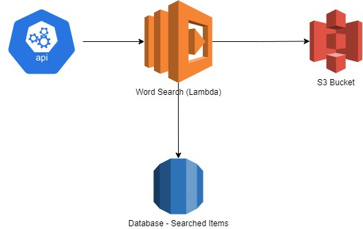

<h1  align="center">Welcome to word-search 👋</h1>

<p>


<a  href="#"  target="_blank">


</a>

</p>

  

> This is a CLI which will take a text file and term to search in that file, It will print all the lines that have the searched term. This CLI will sanatise the search input to make sure it's a proper word and can be searched without special characters except for apostrophy. The functionality is also wrapped into a simple Web API. Which can be called &#34;http://localhost:3000/search?file=novel.txt&search=Arthur&#34;.

  

## Install

```sh
npm install
```
To install this a npm based executable.
```sh
npm link
```

## Run as Web Service

```sh
npm run start
```

## Implementation
The implementation has two different ways of searching the word with in a text file. 

 - In Memory search: The first type of search is based on loading the text file into memory and search for term, there is limitation to this implementation. The maximum size for the text file in the memory is around 750 MB. This is due to limitation of Nodejs's String buffer and Nodejs can only take up to 2GB of memory on 64 bit system.
 - Stream search: The second and default implementation is bases on Nodejs streams which will read the any text file line by line, this provide more memory efficient way to search the files for text but the down side is the processing time. The file will load quickly if kept on the same machine but if the files are to be loaded over the network, the time could rise based on file size, network connection and can break if the network is disconnected. 

## Cache
The following implementation does not have database connected but it can be done by forking the project. The fastest way to create a db was to create a json file with exact name as the txt file and save the occurrences of the term. 

## Server Deployment



  The above diagram describes a server implementation for this project. 
 - Server : The main application has a small foot print, so it can be easily deployed on AWS Lambda as function and can be called when required.
 - Files: The files can be hosted on S3 bucket and loaded as per requirement, this will need a change in the implementation though for connecting S3.
 - Database: Currently the searched terms are saved into json file but for fast retrieval for every file and search term and table can be maintained. 

## Usage
The following command will the run the utility in stream mode, which means the file will be read line by line and results is presented in console.
### Stream Mode
```sh 
word-search novel.txt
input search term: Arthur
```

### In Memory Mode
```sh 
word-search novel.txt true
input search term: Arthur
```

## Run tests
```sh

npm run test

```

## Author

  

👤 **Bilal Ashraf**

  

* Github: [@billalaashraf](https://github.com/billalaashraf)

* LinkedIn: [@bashraf](https://linkedin.com/in/bashraf)
